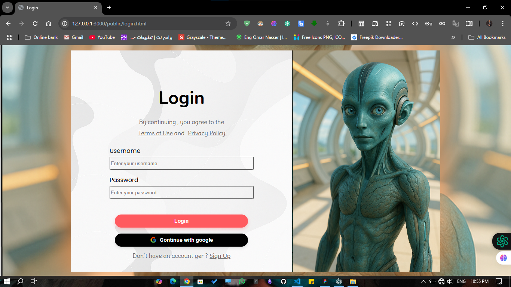
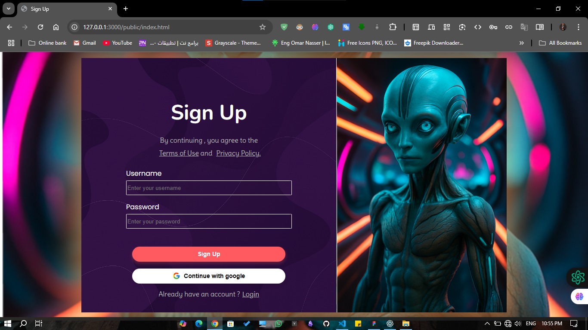
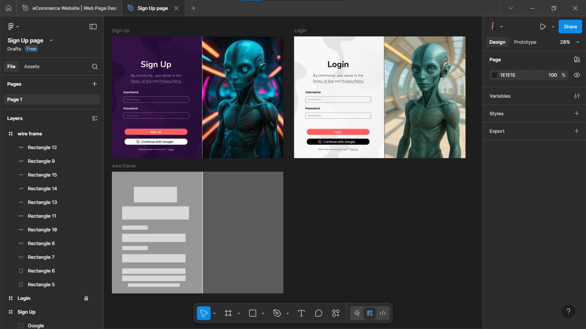

# 🚀 Alien-Themed Auth UI

An eye-catching alien-themed **Login** and **Sign Up** interface built from scratch using **HTML** and **Pure CSS**, based on custom UI design made in **Figma**.

<div align="center">
  
  
</div>

---

## 📐 Features

- ✅ Fully responsive login & sign-up pages  
- 🎨 Custom UI/UX design built with Figma  
- 🌌 Sci-fi/alien visual theme  
- 💻 Clean & semantic HTML5  
- 🎯 Pure CSS styling (No frameworks or libraries)  
- 🔐 Google sign-in button (UI only)  

---

## 📂 Project Structure

```bash
project-root/
│
├── public/
│   ├── login.html         # Login page
│   ├── index.html         # Sign Up page
│   ├── style.css          # Common styles
│   └── assets/
│       ├── login.png      # Screenshot for login page
│       ├── signup.png     # Screenshot for sign up page
│       └── bg-images/     # Optional: backgrounds/images used
│
├── figma/
│   └── design.fig         # Figma file or exported assets
│
└── README.md              # You're here!
```
---

## 📸 Design Preview

> All UI elements are custom-designed in Figma. Here's a sneak peek from the design board:



---

## 🛠 How to Use

1. Clone the repository:
   ```bash
   git clone https://github.com/your-username/alien-auth-ui.git
   cd alien-auth-ui
   ```

2. Open the project in your browser:
   ```bash
   # Using Live Server or just open login.html or index.html manually
   ```

---

## 📌 Future Improvements

- Add backend integration (Node.js / Firebase)
- Real Google OAuth functionality
- Form validation and animations

---

## 🙌 Credits

- 👨‍🎨 UI/UX Design & Development: [Eng Omar Nasser]  
- 🛠 Tools Used: Figma, VS Code, HTML5, CSS3  

